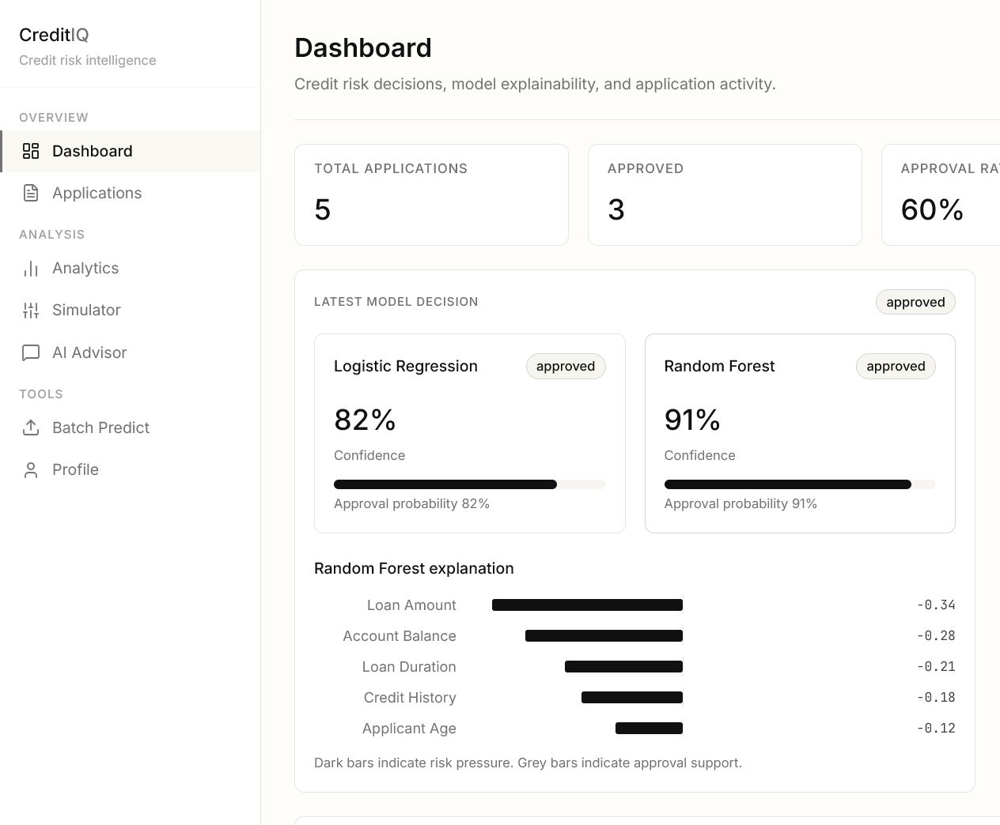
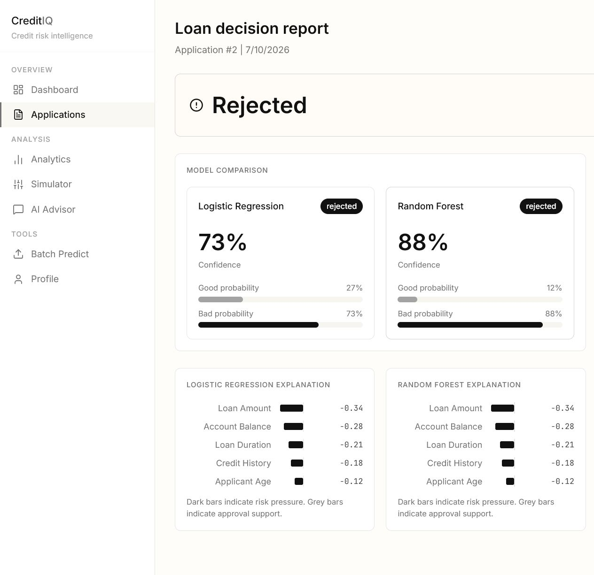
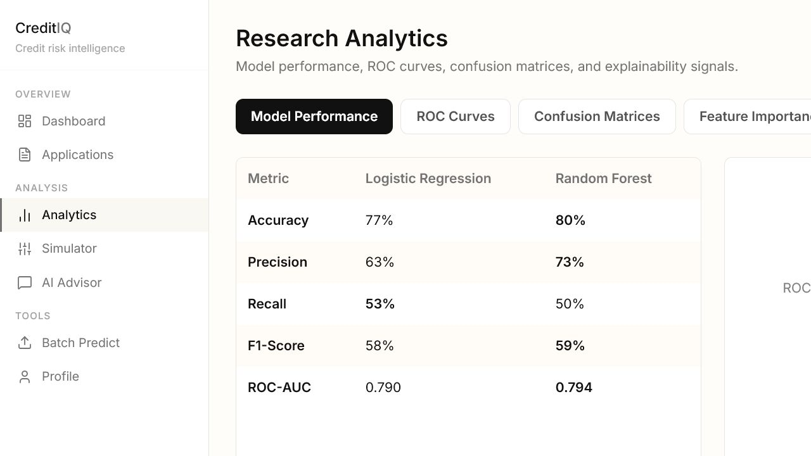
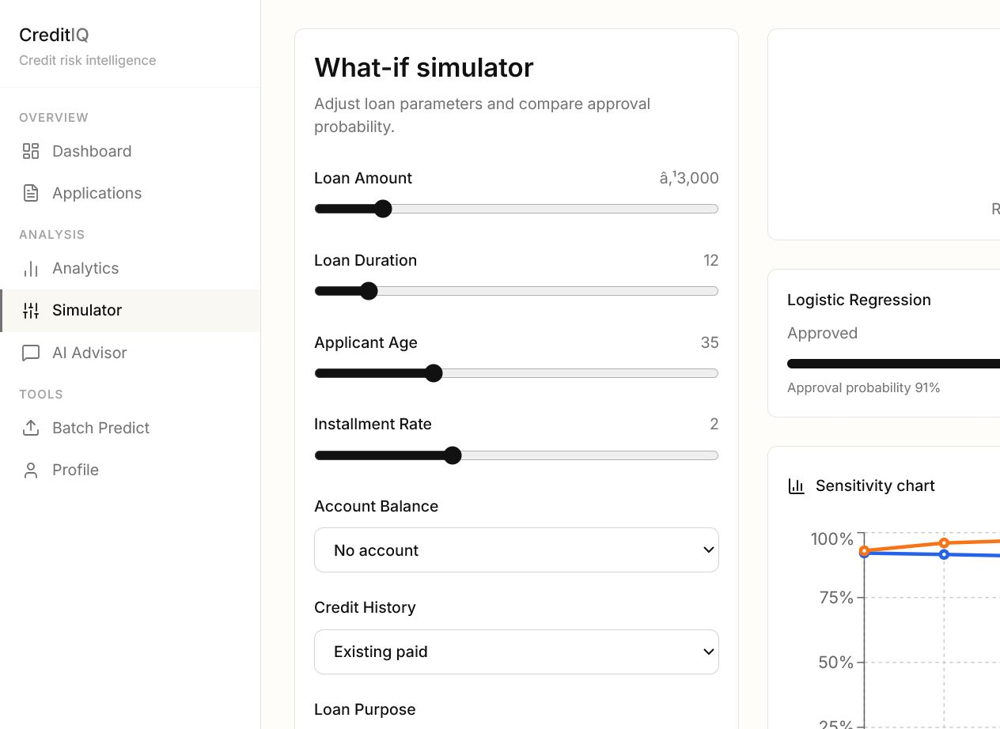
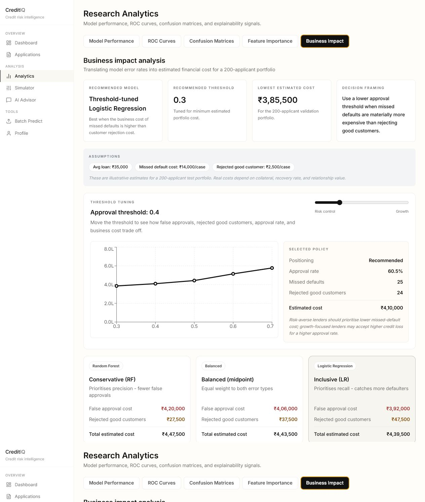
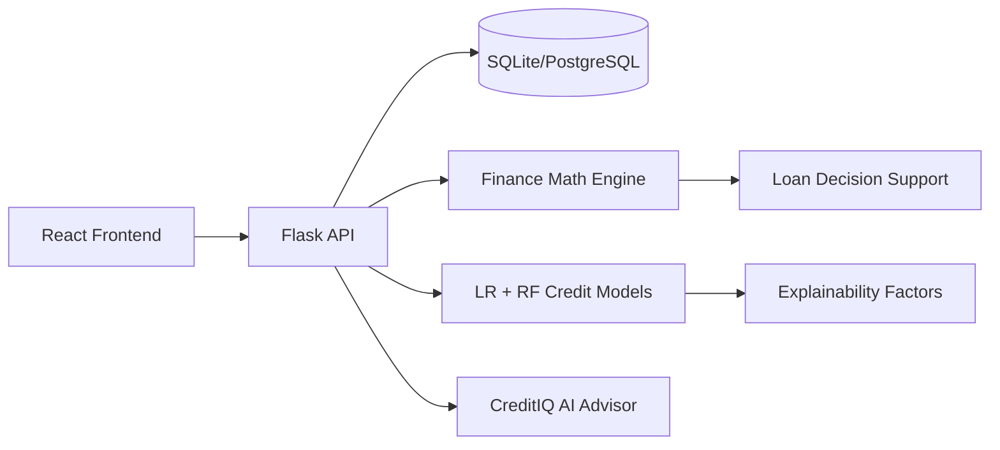

# CreditIQ - AI-Powered Credit Risk Intelligence Platform

CreditIQ is an AI-powered credit risk decision platform that combines ML
scoring, explainability, simulation, and business impact analysis for lending
decisions.

A full-stack decision intelligence application that uses machine learning,
explainable AI, and cost-based threshold tuning to assess credit risk and
recommend lending policies.

## Research Foundation

This project implements and extends ideas from:

- Khalid, S.R. (2025). "Machine learning-based credit scoring: A comparative analysis of logistic regression and random forest models." International Journal of Financial Management and Economics, 8(2):284-294.
- Teles, G. et al. (2019). "Machine learning and decision support system on credit scoring." Neural Computing and Applications.

## Decision Science Framing

CreditIQ is framed as a lender decision-support case study: approve more
customers for growth, or reject more borderline applications to control credit
loss. The app translates model outputs into business tradeoffs by comparing
false approvals, rejected good customers, approval rate, and estimated portfolio
cost under different risk thresholds.

- Problem: reduce credit losses while preserving good-customer approvals.
- Model layer: Logistic Regression and Random Forest trained on German Credit data.
- Evaluation layer: accuracy, precision, recall, F1-score, ROC-AUC, confusion matrices, and feature importance.
- Business layer: cost assumptions convert model errors into estimated INR impact for a 200-applicant portfolio.
- Recommendation layer: threshold tuning identifies the lowest-cost policy and explains how the answer changes with risk appetite.
- Limitation: cost values are illustrative and should be recalibrated with a lender's actual recovery rate, margin, and customer lifetime value.

## Key Features

- Dual credit-risk models: Logistic Regression and Random Forest.
- Explainability: top model factors are shown for every prediction.
- Loan application flow: 3-step German Credit style form with saved decisions.
- Decision report: side-by-side model confidence, probability bars, factor charts, and recommendations.
- What-if simulation: change loan inputs and see approval probability movement.
- Business impact analysis: converts model errors into estimated portfolio cost.
- Threshold tuning: compare approval rate, missed defaults, rejected good customers, and cost under different risk policies.
- AI Credit Advisor: chat UI with loan-context injection and local fallback advice.
- Batch prediction: score multiple credit applications from CSV-style inputs.

## Screenshots

| Dashboard | Application Decision Report |
| --- | --- |
|  |  |

| Research Analytics | What-if Simulator |
| --- | --- |
|  |  |

| Business Impact |
| --- |
|  |

## ML Results

Run `python backend/train_models.py` to reproduce local model artifacts. The analytics page reads `backend/model_metrics.pkl` and visualizes:

| Metric | Logistic Regression | Random Forest |
| --- | ---: | ---: |
| Accuracy | 76.5% | 79.5% |
| Precision | 62.7% | 73.2% |
| Recall | 53.3% | 50.0% |
| F1-Score | 57.7% | 59.4% |
| ROC-AUC | 0.7905 | 0.7945 |

## Explainability Validation

SHAP values are an approximation of feature contribution, not ground truth.
This project validates them two ways: structural consistency, where every SHAP
reason's direction label is checked against its impact sign, and domain sanity
checks against representative loan profiles.

**Encoding fix**: ordinal features (`checking_status`, `savings_status`,
`credit_history`, `employment`) were initially encoded with sklearn's
`LabelEncoder`, which assigns codes by appearance order rather than true risk
order. This made LR coefficients directionally ambiguous for these features.
Switching to explicit ordinal mappings based on documented UCI German Credit
semantics fixed the checking-status direction mismatch and improved Random
Forest accuracy from 77.5% to 79.5% (ROC-AUC 0.78 -> 0.79), since the model now
learns from a more meaningful feature representation.

| Domain check | Result |
| --- | --- |
| High loan amount appears as a top rejection factor | Pass |
| Checking-status SHAP direction matches LR coefficient sign | Pass after ordinal encoding fix |
| Critical credit history sanity check | Pass |
| Young/unemployed profile flags employment as a risk factor | Pass |
| Small/short loan never shows credit amount as risk-increasing | Pass after domain calibration |

5 of 5 domain checks pass. The final fix keeps model probabilities unchanged
but applies a presentation-layer monotonic sanity calibration for obvious
low-risk extremes: near-minimum loan amounts and very short durations are not
shown as risk-increasing explanation factors when their raw Random Forest SHAP
approximation is a small non-monotonic artifact.

## Tech Stack

- Frontend: React, Vite, Tailwind CSS, Recharts, Lucide icons.
- Backend: Flask, SQLAlchemy, Flask-JWT-Extended.
- Database: SQLite for local development. PostgreSQL can be used through `DATABASE_URL`.
- ML/Scoring: scikit-learn Logistic Regression, Random Forest, model metrics, and explainability factors.
- AI: OpenAI-compatible assistant route with context-aware fallback.

## Quick Start

Backend:

```bash
cd backend
python -m venv .venv
.venv\Scripts\activate
pip install -r requirements.txt
copy .env.example .env
python train_models.py
python create_demo_user.py
python run.py
```

Frontend:

```bash
cd frontend
npm install
npm run dev
```

Open:

- Frontend: `http://127.0.0.1:5173`
- Backend health: `http://127.0.0.1:5000/api/v1/health`

## Demo User

The backend seeds a demo user with 5 sample credit applications:

- Email: `demo@creditiq.com`
- Password: `demo12345`

Run `python backend/create_demo_user.py` after `train_models.py` to seed
this account if it doesn't already exist.

## Demo And Deployment

Local demo steps are documented in [docs/DEMO_GUIDE.md](docs/DEMO_GUIDE.md).
Deployment options are documented in [docs/DEPLOYMENT.md](docs/DEPLOYMENT.md).

Docker demo:

```bash
docker compose up --build
```

Then open `http://localhost:8080`. The backend container seeds the demo account
against the same SQLite database used by the running Flask API.

## Main API Endpoints

| Area | Endpoint |
| --- | --- |
| Auth | `POST /api/v1/auth/register`, `POST /api/v1/auth/login`, `GET /api/v1/auth/profile` |
| Dashboard | `GET /api/v1/dashboard` |
| Applications | `GET /api/v1/ml/applications`, `GET /api/v1/ml/applications/:id` |
| Prediction | `POST /api/v1/ml/predict`, `POST /api/v1/ml/batch` |
| Analytics | `GET /api/v1/ml/metrics`, `GET /api/v1/ml/business-impact` |
| Simulation | `POST /api/v1/ml/simulate` |
| Assistant | `POST /api/v1/assistant/chat` |
| Health | `GET /api/v1/health` |

## Architecture



## Verification

```bash
cd backend
pytest -v
cd frontend
npm run build
```

Backend tests cover authentication, ML prediction responses, model quality, and
SHAP/domain consistency checks. The frontend build verifies React/Vite
production bundling.

The frontend build may warn about large chunks because routes are bundled together. This is not a runtime failure; future polish can lazy-load pages with `React.lazy`.
