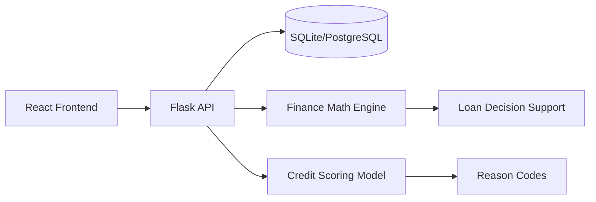

# Credit Intelligence

AI-powered credit scoring and loan decision support system for personal finance tracking.

## What It Does

- Tracks income, expenses, EMI payments, and category spending.
- Shows a real monthly dashboard with savings rate, credit score, risk band, and previous-month trends.
- Provides analytics for income vs expenses, top categories, unusual spending alerts, and score history.
- Supports budget planning with category limits and 80% warning states.
- Calculates EMI, total payable, total interest, and amortization schedules.
- Gives loan decisions using a fuzzy-risk style decision support layer.
- Provides a context-aware assistant that can answer using the user's transactions, budgets, loans, and score.
- Supports CSV transaction import with validation and duplicate-preview support.

## Research Basis

The project is aligned with credit-scoring literature around:

- Logistic regression and random forest based credit scoring.
- ROC-AUC, precision, recall, confusion matrix, and imbalanced-data evaluation.
- Explainable score factors/reason codes.
- Decision support using fuzzy logic style rules for loan approval, review, or rejection.

## Tech Stack

- Frontend: React, Vite, Tailwind CSS, Recharts, Lucide icons.
- Backend: Flask, SQLAlchemy, Flask-JWT-Extended.
- Database: SQLite for local development. PostgreSQL can be used through `DATABASE_URL`.
- ML/Scoring: Random Forest model when available, deterministic finance fallback for stable behavior.

## Quick Start

Backend:

```bash
cd backend
python -m venv .venv
.venv\Scripts\activate
pip install -r requirements.txt
copy .env.example .env
python run.py
```

Frontend:

```bash
cd frontend
npm install
npm run dev
```

Open:

- Frontend: `http://127.0.0.1:5173`
- Backend health: `http://127.0.0.1:5000/api/v1/health`

## Demo User

The backend seeds a demo user:

- Email: `demo@credit.ai`
- Password: `password123`

## Main API Endpoints

| Area | Endpoint |
| --- | --- |
| Auth | `POST /api/v1/auth/register`, `POST /api/v1/auth/login`, `GET /api/v1/auth/profile` |
| Dashboard | `GET /api/v1/dashboard` |
| Transactions | `GET/POST /api/v1/transactions`, `PUT/DELETE /api/v1/transactions/:id` |
| CSV Import | `POST /api/v1/transactions/upload-csv`, `POST /api/v1/transactions/upload-csv/preview` |
| Budgets | `GET/POST /api/v1/budgets`, `DELETE /api/v1/budgets/:id` |
| Analytics | `GET /api/v1/analytics` |
| Loans | `GET/POST /api/v1/loans` |
| Loan Decision | `POST /api/v1/decision/loan` |
| ML | `POST /api/v1/ml/credit-score/predict`, `GET /api/v1/ml/credit-score/history` |
| Assistant | `POST /api/v1/assistant/chat` |

## Architecture



## Verification

```bash
python -m compileall backend\app
cd frontend
npm run build
```

The frontend build may warn about large chunks because routes are bundled together. This is not a runtime failure; future polish can lazy-load pages with `React.lazy`.
