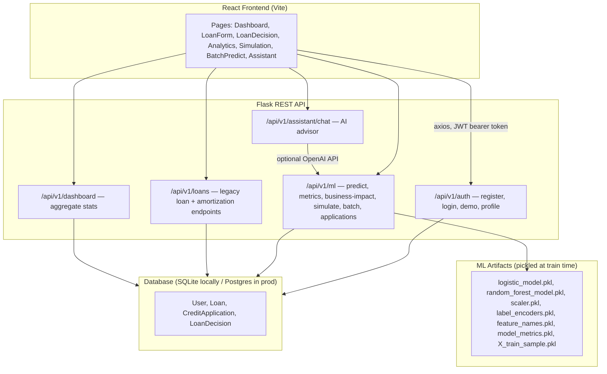

# CreditIQ — Complete Mastery Guide (0 → 100)

This document exists so you can answer *any* question about this project, from "what is it" to "walk me through this specific line of code." Read it top to bottom once, then use it as a reference before interviews.

---

## Part 1 — Why This Project & What It Is

### Why I chose this project (your narrative)

Say something like this in your own words:

> "I wanted a project that wasn't just a tutorial CRUD app. Fintech credit scoring forces you to deal with real engineering tradeoffs: multiple models that can disagree, explaining a black-box decision to a non-technical user, and turning a confusion matrix into a rupee cost a business person actually cares about. It let me combine ML, a real backend with auth, and a frontend that presents the ML output usefully — which is closer to what an actual ML/backend engineering job looks like than a single Jupyter notebook."

Key point for interviews: **you are not claiming to be an ML researcher**. You're demonstrating you can take a model, wrap it in a real API, make it explainable, connect it to business decisions, and ship it. That is exactly what most "ML Engineer" / "Data Scientist in industry" / "backend + ML" job descriptions actually want.

### What is CreditIQ, explained simply

Imagine a bank loan officer. Someone applies for a loan. The officer looks at: do they have savings? A job? Paid back past loans on time? How big is the loan? Based on that, the officer says **yes** or **no**.

CreditIQ is software that plays the loan officer's role, twice, using two different "brains" (machine learning models), then:
1. Says yes/no (approve/reject)
2. Says **why** (which factors mattered — "your loan amount is too high," "you have no checking account")
3. Says **what it would cost the bank** if this decision is wrong, in real rupees
4. Lets you **experiment**: "what if I asked for a smaller loan instead?"

It is a full web app: you log in, fill a form, get a decision report with charts, and can even chat with an AI advisor about it.

### The 30-second pitch (memorize this)

> "CreditIQ is a full-stack credit risk platform. A React frontend talks to a Flask API that runs two ML models — Logistic Regression and Random Forest — trained on the UCI German Credit dataset. Every prediction comes with a SHAP-based explanation of which factors drove it, and there's a business layer that converts model errors into estimated rupee cost so you can tune the approval threshold based on risk appetite, not just accuracy."

### The 2-minute pitch (structure)

1. **Problem**: Lenders need to decide who to approve, and need to justify *why* (regulatory + trust reasons), and need to know the cost tradeoff of being wrong in either direction.
2. **What I built**: full stack app — Flask REST API + React SPA, JWT auth, SQLite/Postgres.
3. **The ML**: two models trained on 1000 real credit applications (German Credit dataset), scored on accuracy/precision/recall/F1/ROC-AUC, both models run on every prediction so they can be compared/disagree.
4. **The explainability**: SHAP values show which of the 20 input features pushed the decision toward approval or rejection — not just "the model said no," but "the model said no *because of X*."
5. **The debugging story**: found and fixed an encoding bug that was making explanations misleading (see Part 9 — this is your best individual talking point).
6. **The business layer**: false negatives (missed defaulters) and false positives (rejected good customers) don't cost a bank the same amount — I built a threshold-tuning view that shows the cost curve and recommends a policy.
7. **What's next**: deploy the backend fully, add pagination, consolidate two overlapping DB tables (see Part 12).

---

## Part 2 — Architecture: How It All Fits Together



### Request lifecycle: submitting a loan application (the golden path)

1. User fills the 3-step form in [LoanForm.jsx](../frontend/src/pages/LoanForm.jsx) → clicks **Submit**.
2. Frontend calls `POST /api/v1/ml/predict` with all 20 raw feature values (e.g. `checking_status: "A14"`, `credit_amount: 3000`).
3. Backend ([ml.py](../backend/app/routes/ml.py)):
   - `_normalize_credit_payload` fills any missing fields with sane defaults and casts types.
   - `_encode_credit_payload` turns human-readable categorical codes (`"A11"`, `"A14"`) into numbers the model understands, using either the hand-built ordinal maps or the fitted `LabelEncoder`s from training.
   - `_predict_probabilities` runs both models: LR needs the features **scaled** (StandardScaler), RF does not.
   - `_credit_model_result` turns each model's probability into `approved`/`rejected` + confidence, and calls `_fallback_reasons` to get the top-5 SHAP factors.
   - `_dual_credit_prediction` bundles LR + RF results; **Random Forest's decision becomes the `final_decision`** (it's the model chosen as primary, since RF had the higher accuracy in training).
   - `_save_application_if_authenticated` silently saves a `CreditApplication` row **only if** the request carries a valid JWT (auth is *optional* here — anonymous predictions still work, they just aren't persisted).
4. Frontend also calls `POST /api/v1/loans` to log a `Loan` record with the decision, then navigates to `/applications/:id`.
5. [LoanDecision.jsx](../frontend/src/pages/LoanDecision.jsx) renders both models' confidence bars, two `SHAPChart` explanation charts, and follow-up actions (run simulation, ask advisor).

---

## Part 3 — Tech Stack: What Each Piece Does, and What to Learn

### Backend

| Technology | What it does in this project | What to learn if you're shaky |
|---|---|---|
| **Python** | Language for everything backend + ML | Basic syntax, list/dict comprehensions, `try/except`, classes |
| **Flask** | Micro web framework — defines routes, request/response handling | Blueprints, `request`/`jsonify`, app factory pattern (`create_app`) |
| **Flask-SQLAlchemy** | ORM — Python classes ↔ database tables, no raw SQL needed | What an ORM is, `db.Model`, `db.Column`, querying with `.filter_by()` |
| **Flask-JWT-Extended** | Issues and verifies JWT tokens for login sessions | What a JWT is (header.payload.signature), stateless auth, `@jwt_required()` |
| **Flask-Limiter** | Rate limiting (5 login attempts/min) to slow brute-force attacks | What rate limiting is, why `key_func=get_remote_address` (per-IP) |
| **Flask-CORS** | Lets the React frontend (different origin/port) call this API | Same-origin policy, why browsers block cross-origin requests by default |
| **SQLite / PostgreSQL** | Local dev DB / production DB (switch via `DATABASE_URL` env var) | SQL basics: SELECT/INSERT/foreign keys/indexes |
| **scikit-learn** | Trains and runs the Logistic Regression + Random Forest models | `fit`/`predict`/`predict_proba`, `train_test_split`, `StandardScaler` |
| **pandas / numpy** | Data wrangling — building the feature DataFrame per request | DataFrame basics, `.map()`, dtypes |
| **SHAP** | Explains individual predictions — which features pushed the score which way | `LinearExplainer` vs `TreeExplainer`, what a Shapley value is conceptually |
| **gunicorn** | Production WSGI server (Flask's built-in server isn't for production) | Why dev servers aren't production-safe |
| **pytest / pytest-flask** | Automated tests (regression thresholds + explainability sanity checks) | Fixtures, `assert`, test client pattern |

### Frontend

| Technology | What it does in this project | What to learn if you're shaky |
|---|---|---|
| **React 18** | Component-based UI, state via hooks (`useState`, `useEffect`) | Function components, props, hooks, controlled inputs |
| **Vite** | Dev server + production bundler (fast alternative to Create React App) | Just know it's a build tool; `npm run dev` / `npm run build` |
| **React Router v6** | Client-side routing (`/dashboard`, `/applications/:id`, etc.) | `<Routes>`, `<Route>`, `useParams`, `useNavigate`, protected routes |
| **Axios** | HTTP client for calling the Flask API, with interceptors | Promises, `.then/.catch`, request/response interceptors |
| **Tailwind CSS** | Utility-class styling (`className="rounded-lg border p-4"`) | Utility-first CSS mental model — no separate CSS files per component |
| **Recharts** | All the charts: radar, line (ROC curve), bar (feature importance) | `<ResponsiveContainer>`, feeding it arrays of `{x, y}` objects |
| **PapaParse** | Parses uploaded CSV files client-side for batch prediction | CSV parsing basics |
| **Lucide-react** | Icon set | Just import and use `<IconName />` |

### The one sentence you should be able to say for *any* library above:
"It's [what it is], and I used it here for [specific purpose in this app]." That's the bar — don't memorize docs, memorize *your usage*.

---

## Part 4 — The ML, Deeply Explained

### The dataset

[train_models.py](../backend/train_models.py) loads the **UCI German Credit Data** (or a synthetic fallback if the download fails, or a local CSV cache if present) — 1000 historical loan applications, 20 input features + 1 target (`1` = good credit, `2` = bad credit, remapped to `0`/`1`).

The 20 features cover: checking account balance, loan duration, credit history, purpose, loan amount, savings, employment length, installment rate, personal status, guarantors, residence duration, property owned, age, other payment plans, housing, existing credits, job type, dependents, telephone ownership, foreign-worker status.

### Feature encoding — the most important thing to understand deeply

Models only understand numbers. Four features have a **genuine real-world order** (e.g., "no checking account" is objectively lower-risk than "overdrawn"), so they're mapped explicitly with hand-written dictionaries (`ORDINAL_MAPS` in both [train_models.py](../backend/train_models.py) and [ml.py](../backend/app/routes/ml.py)):

```python
"checking_status": {"A14": 0, "A13": 1, "A12": 2, "A11": 3}  # 0=no account (safe) → 3=overdrawn (risky)
```

Every other categorical feature (purpose, job type, housing, etc.) has **no natural order**, so it uses scikit-learn's `LabelEncoder`, which just assigns arbitrary integers by order-of-appearance. That's fine for those features because Random Forest doesn't care about ordering (it splits on thresholds), and for Logistic Regression the coefficient magnitude/sign just won't have a "higher=riskier" interpretation for those specific features — which is acceptable since we only *need* that property for the four ordinal features.

**Why this matters**: originally, all categorical columns — including the four ordinal ones — went through `LabelEncoder`, which assigns codes by *whatever order the values happened to appear in the data*, not by risk. That silently broke the interpretability of the Logistic Regression coefficients for those columns. See Part 9 for the full bug story — **this is your best "tell me about a time you debugged something" answer.**

### Feature scaling

`StandardScaler` (mean=0, std=1) is fit on the training data and applied **only for Logistic Regression**. Why: LR's math (linear combination of `weight × feature`) is sensitive to feature magnitude — a feature ranging 0–18,000 (loan amount) would dominate a feature ranging 0–4 (installment rate) purely due to scale, not real importance. Random Forest is a tree model — it splits on `feature > threshold`, so raw scale doesn't affect it, hence RF trains on unscaled data.

### The two models

**Logistic Regression** (`sklearn.linear_model.LogisticRegression`, `solver="lbfgs"`)
- A linear model: computes a weighted sum of all features, passes it through a sigmoid function to get a probability between 0 and 1.
- Easy to interpret: each feature gets one coefficient. Positive coefficient (after our encoding convention) = pushes toward bad credit.
- Generally more stable/less prone to overfitting on small/simple relationships, but can't capture complex non-linear interactions between features.

**Random Forest** (`sklearn.ensemble.RandomForestClassifier`, `n_estimators=100`)
- An ensemble of 100 decision trees, each trained on a random subset of data/features (bagging), predictions averaged.
- Captures non-linear relationships and feature interactions automatically.
- Less directly interpretable per-feature (no single coefficient) — that's exactly why **SHAP** is needed for RF, whereas LR's own coefficients are already somewhat interpretable.
- In this project, RF scored slightly higher (79.5% accuracy vs 76.5%), so its decision is used as the **final/primary decision**, while LR is still shown for comparison and disagreement-detection (`consensus` flag).

### Metrics — plain English (memorize these formulas)

Given a confusion matrix for "predicting bad credit":

| | Predicted Good | Predicted Bad |
|---|---|---|
| **Actually Good** | True Negative (TN) | False Positive (FP) |
| **Actually Bad** | False Negative (FN) | True Positive (TP) |

- **Accuracy** = (TP+TN) / total — overall % correct. Can be misleading on imbalanced data.
- **Precision** = TP / (TP+FP) — "of everyone I flagged as bad, how many actually were?" High precision = few good customers wrongly rejected.
- **Recall** = TP / (TP+FN) — "of everyone actually bad, how many did I catch?" High recall = few defaulters slip through.
- **F1** = harmonic mean of precision & recall — one number balancing both.
- **ROC-AUC** = how well the model ranks bad-credit applicants above good-credit applicants across *all* possible thresholds, not just 0.5. 1.0 = perfect separation, 0.5 = random guessing. This project's RF scores ~0.79.
- **Confusion matrix**: the raw counts above — this project's business-impact layer (Part 6) literally multiplies FN and FP counts by assumed rupee costs.
- **Cross-validation (`cv_scores`, 5-fold)**: retrains/tests the model 5 times on different splits of the data to check the accuracy number isn't a fluke of one particular train/test split.

**Interview trap to be ready for**: "Which metric matters most for a lender?" → Answer: it depends on risk appetite — a risk-averse bank cares more about **recall** on the bad-credit class (catch defaulters, accept some false rejections), a growth-focused bank cares more about **precision**/approval rate. This project's entire "Business Impact" tab exists to make that tradeoff explicit in rupees instead of abstract percentages.

### SHAP explainability — how a "why" is generated

- `shap.LinearExplainer` for LR (needs a background sample of training data — `X_train_sample.pkl`, saved during training).
- `shap.TreeExplainer` for RF (works natively with tree structure, no background sample needed).
- Both return, per prediction, an **impact value per feature** — how much that feature pushed the prediction away from the average/baseline prediction.
- Top 5 by absolute impact are shown. Sign convention used in this app: **impact > 0 means "pushes toward the bad-credit class"**, which the API labels `direction: "negative"` (bad for the applicant) in the response; impact < 0 → `direction: "positive"`.
- **Fallback**: if SHAP itself throws an exception (e.g., version mismatch), `_fallback_reasons` in [ml.py](../backend/app/routes/ml.py) falls back to `coefficient × feature value` for LR or raw `feature_importances_` for RF — cruder, but keeps the API from ever 500-ing.

### The domain-sanity calibration layer (`_apply_domain_sanity_to_reasons`)

Random Forest can learn locally non-monotonic splits in sparse regions of the data (e.g., very few training examples at the absolute minimum loan amount), which can make SHAP show a *tiny* loan amount as slightly risk-increasing — which contradicts basic domain logic (a $500 loan for 6 months is about as safe as it gets). This function does **not** change the model's actual probability/decision — it only adjusts the **display** of explanation reasons for two specific low-risk extremes (`credit_amount <= 1000`, `duration <= 6`) so the explanation never contradicts obvious real-world intuition. This is validated by dedicated tests in [test_shap_consistency.py](../backend/tests/test_shap_consistency.py).

---

## Part 5 — Backend Code Walkthrough (File by File)

### `backend/run.py`
Entry point. Creates the Flask app via the factory function and runs the dev server on port 5000. In production, `gunicorn` imports `app` from this module instead of calling `.run()`.

### `backend/app/config.py`
Reads `.env` (via `python-dotenv`), sets `SECRET_KEY`, `JWT_SECRET_KEY`, JWT expiry (access token 1hr, refresh 7 days — though refresh tokens aren't actually issued anywhere in the current auth routes, only access tokens), and the database URL. `_database_url()` defaults to a local SQLite file unless `DATABASE_URL` is set to something other than the default (used for Postgres in production).

### `backend/app/extensions.py`
Creates **singleton instances** of `db` (SQLAlchemy), `jwt` (JWTManager), and `limiter` (Flask-Limiter, in-memory storage, default 200/day + 50/hour per IP) *before* the app exists, so they can be imported anywhere without circular imports, then wired to the actual app inside `create_app()` via `.init_app(app)`. This is the standard Flask "application factory" pattern.

### `backend/app/__init__.py` — `create_app()`
1. Builds the Flask app, loads config, applies CORS.
2. Initializes db/jwt/limiter.
3. Registers 5 blueprints under `/api/v1/...` prefixes.
4. Defines root/health-check routes.
5. Calls `db.create_all()` (creates tables if they don't exist) then `_ensure_sqlite_columns()` — a **hand-rolled lightweight migration**: since this project doesn't use Flask-Migrate/Alembic for actual migrations, this function checks (via raw `PRAGMA table_info`) whether newer columns exist on an existing local SQLite file and `ALTER TABLE ADD COLUMN`s them if missing. This only runs for SQLite (`if engine.dialect.name != "sqlite": return`) — Postgres in production is expected to start fresh or be migrated properly.

*Interview note*: if asked "why not use Alembic," the honest answer is: this was the pragmatic choice for a single-developer local-first project where the schema evolved iteratively; a team project with a shared production database would need real migrations.

### `backend/app/models.py` — the 4 tables
- **`User`**: id, name, email (unique), password_hash, created_at.
- **`Loan`**: an older, general-purpose loan table — has both simple fields (`loan_amount`, `emi`, `interest_rate`) *and* (added later via the ALTER TABLE migration) the full set of German-Credit-style fields, for backward compatibility with `/api/v1/loans`.
- **`CreditApplication`**: the newer, primary table — every German Credit field **plus** both models' decisions/confidences/probabilities/SHAP-reasons-as-JSON-text, in one row. This is what `/api/v1/ml/predict` writes to and what `/api/v1/ml/applications` reads from.
- **`LoanDecision`**: a 1:1 side table linked to `Loan` (`db.relationship(...backref="decision")`), storing the same kind of decision data as `CreditApplication` but tied to the older `Loan` table instead. Used by `/api/v1/loans/<id>/decision`.

**Known duplication** (good self-critique talking point, see Part 12): `CreditApplication` and the `Loan`+`LoanDecision` pair store overlapping data because the schema evolved — the app grew a cleaner unified table but kept the old one for the `/loans` routes and frontend paths (`/loans/*` still works as an alias alongside `/applications/*` in [App.jsx](../frontend/src/App.jsx)).

### `backend/app/finance.py` — pure math utilities, mostly independent of ML
- `to_decimal`/`money`: safe decimal parsing/rounding for currency (`Decimal` avoids float rounding errors in money math).
- `emi_for_loan`: the standard reducing-balance EMI formula: `EMI = P × r × (1+r)^n / ((1+r)^n − 1)` where `r` is the monthly interest rate.
- `loan_months`: solves the EMI formula **backwards** for the number of months, given P, rate, and a target EMI (uses a logarithm — derived algebraically from the EMI formula).
- `amortization_schedule`: month-by-month principal/interest/balance breakdown, used by `/api/v1/loans` to show estimated total interest.
- `score_from_finances` / `decision_support`: a **separate, rule-based** (not ML) "credit score" and approve/reject/manual-review engine driven by income/expense/EMI ratios with hand-tuned weights (a "fuzzy risk" score). **Not currently called by any active route** — it's leftover/parallel logic from an earlier design iteration of the app, before the ML-based dual-model flow became the primary decision path. Worth mentioning proactively if asked "walk me through every function in this file" rather than being caught not knowing it's unused.
- `safe_calculate`: a hand-written **AST-based expression evaluator** — parses a math expression string (e.g., `"3000 * 1.08"`) into a Python AST and only permits a whitelist of safe operations (`+ - * / **`, numbers only), explicitly to avoid ever calling Python's real `eval()` on user input (which would be a code-injection vulnerability). Also currently unused by any route, but it's a strong security-awareness talking point if asked about how you'd safely evaluate user-supplied formulas.

### `backend/app/routes/ml.py` — the heart of the app
Already covered in depth in Part 4 and Part 2's request lifecycle. Endpoint summary:

| Route | Method | Purpose |
|---|---|---|
| `/ml/predict` | POST | Run both models on one application, optionally save if authenticated |
| `/ml/metrics` | GET | Return the pickled training-time metrics (accuracy, ROC curves, etc.) — falls back to hardcoded illustrative numbers if the pickle is missing |
| `/ml/business-impact` | GET | Convert confusion-matrix errors into ₹ cost at a given approval threshold |
| `/ml/simulate` | POST | Vary one field across a range, return the approval-probability curve (what-if sensitivity) |
| `/ml/batch` | POST | Score up to 100 rows from CSV upload or JSON body |
| `/ml/applications` | GET (JWT required) | List the logged-in user's saved applications |
| `/ml/applications/<id>` | GET (JWT required) | Full detail incl. both models' SHAP reasons |

Notice `/predict`, `/metrics`, `/business-impact`, `/simulate`, `/batch` have **no `@jwt_required()`** — predictions work for anonymous/demo use; only *listing saved history* requires login. `_save_application_if_authenticated` uses `verify_jwt_in_request(optional=True)` to silently attach the save only if a valid token happens to be present.

### `backend/app/routes/auth.py`
- `/register`: validates name/email/password (password needs 8+ chars and at least one digit), hashes with `werkzeug.security.generate_password_hash` (PBKDF2 under the hood), rate-limited 5/min.
- `/login`: **notable design choice** — if the email doesn't exist yet, it auto-registers the user right there in the login endpoint (as long as the password meets the policy), rather than returning "user not found." This is a UX/demo-friendliness decision (frictionless onboarding for a portfolio demo) — be ready to explain it as a deliberate tradeoff, not an accident: a production consumer-fintech app would very likely *not* want silent auto-registration on login (verification, fraud, compliance concerns), so this is something you'd flag as demo-only behavior.
- `/demo`: seeds (idempotently — checks if the demo user already has loans first) a fixed demo account with 2 pre-scored sample applications, so recruiters/interviewers can explore the app without registering.
- `/profile`: returns the logged-in user's basic info (id/name/email) — no password/hash ever returned.
- Rate-limit errors return a friendly 429 JSON via `@auth_bp.errorhandler(429)`.

### `backend/app/routes/loans.py`
Legacy/parallel path to `ml.py`'s `CreditApplication` flow, operating on `Loan`+`LoanDecision`. Adds EMI/amortization display fields via `finance.py` helpers that `CreditApplication` doesn't need (since `CreditApplication` doesn't track a real repayment schedule, just the credit-risk decision).

### `backend/app/routes/assistant.py`
- If `OPENAI_API_KEY` isn't set, immediately returns a friendly message telling the user to configure it — never crashes.
- If an `application_id` is passed, loads that `CreditApplication`'s top-3 RF SHAP reasons and final decision, and injects them into the system prompt as `LOADED APPLICATION #...` context, so the AI can answer "why was I rejected" with the actual factors instead of generic advice.
- Calls OpenAI's chat completion API (`gpt-4o-mini` by default, configurable) with the last 10 turns of conversation history plus the new message.
- **If the OpenAI call throws for any reason** (bad key, network, rate limit, quota) — falls back to `_fallback_reply`, a simple keyword-matching rule engine (checks for "shap", "emi"/"loan"/"approval", "roc"/"auc"/"confusion") that gives a canned but genuinely useful explanation, so the Assistant page never breaks even with zero API budget. This dual-path design (best-effort live LLM + guaranteed local fallback) is a good "resilience/graceful degradation" talking point.

### `backend/app/routes/dashboard.py`
Aggregates counts (approved/rejected/pending/consensus rate) — **prefers `CreditApplication` records if any exist**, otherwise falls back to the older `Loan`/`LoanDecision` pair, so the dashboard works correctly regardless of which flow was used to create the data. Also reads `model_metrics.pkl` directly to surface RF's training accuracy as a headline dashboard number.

### `backend/train_models.py`
The script you run once (`python train_models.py`) to (re)produce all the `.pkl` artifacts `ml.py` loads at import time. Walk-through:
1. `load_dataset()`: tries local CSV cache → tries downloading from UCI → falls back to a synthetic generator (`synthetic_dataset`) that fabricates a plausible dataset with the same columns and a risk-correlated target, so the whole pipeline still works even fully offline.
2. `encode_features()`: applies the ordinal maps, then `LabelEncoder` on everything else.
3. Train/test split 80/20, **stratified** on target (keeps the good/bad ratio consistent in both splits — important since defaults are the minority class).
4. Fit `StandardScaler` on train only, transform both train/test (never fit on test — avoids data leakage).
5. Train LR (on scaled data) and RF (on raw data).
6. `evaluate()`: computes all metrics, and for LR also extracts sorted `coefficients`, for RF sorted `feature_importances`.
7. 5-fold cross-validation for both models, storing mean/std.
8. Prints an ordinal-feature coefficient sanity check as a build-time regression guard, then pickles 7 artifact files.

### `backend/tests/` — testing philosophy
- **`test_ml.py`**: structural/contract tests — predict always returns valid shape, confidence in [0,1], never 500s even on missing/empty input.
- **`test_model_quality.py`**: **regression thresholds** — fails the build if accuracy or ROC-AUC for either model drops below 0.70 after a retrain. This is a CI safety net against "someone retrains the model and it silently gets worse."
- **`test_shap_consistency.py`**: the most interesting file — **domain sanity checks**, not just code-correctness checks:
  - SHAP direction sign always matches the documented convention.
  - A very large loan + long duration shows `credit_amount` as a top-3 factor for at least one model.
  - `checking_status`'s SHAP direction for a sample matches its LR coefficient's sign (catches encoding/training-vs-inference mismatches).
  - A small, short loan never shows `credit_amount`/`duration` as risk-increasing.
  - Critical credit history never shows as a strongly approval-favoring factor.
  - A "summary report" test that isn't pass/fail — it prints a human-readable table across 5 representative profiles (this is literally the artifact the README's "5 of 5 domain checks pass" table is built from).
- **`test_auth.py`**: registration/login/duplicate-email/invalid-password flows.

**Interview gold**: explain that most people only write "does the code run" tests for ML. This project *also* tests "does the explanation make domain sense," which is a genuinely more advanced testing concept (explainability validation) that most junior candidates have never even heard of.

---

## Part 6 — Frontend Code Walkthrough (File by File)

### `frontend/src/main.jsx`
Standard Vite/React entry point — mounts `<App />` into the DOM, wrapped in `<BrowserRouter>`.

### `frontend/src/App.jsx`
Defines every route with `react-router-dom` v6. `Protected` is a simple wrapper component: if there's no `token` in `localStorage`, redirect to `/login`; otherwise render the page inside `AppLayout` (sidebar + content). Note `/applications` and `/loans` point to the *same* `Applications` component — evidence of the same old/new naming duplication mentioned earlier, kept so both URL styles work.

### `frontend/src/api.js`
One shared `axios` instance with `baseURL` from `VITE_API_BASE_URL` (falls back to relative `/api/v1` for same-origin deployment). A **response interceptor** watches every API call: if it gets back `401` (unauthorized) or `422` (invalid JWT), it clears the stored token/user and fires a custom `auth-changed` event so the rest of the app can react (e.g., redirect to login) without every single API call needing its own error-handling boilerplate. `setAuthToken` sets/clears the `Authorization: Bearer <token>` header globally.

### `frontend/src/creditFeatures.js`
The single source of truth shared by every page: human-readable `FEATURE_LABELS`, the code→label `VALUE_LABELS` maps (so the UI never shows raw `"A11"` to a user, always "Below 0 DM"), `DEFAULT_LOAN_INPUT` (used to pre-fill forms and simulations), and small formatters (`money`, `percent`, `displayValue`). Centralizing this avoids every page re-implementing the same lookup tables.

### `frontend/src/pages/LoanForm.jsx`
A 4-step wizard (Personal → Financial → Loan → Review) using local component state (`useState`) for the form object and current step index. `fieldControl()` renders either a `<select>` (for categorical fields, pulling options from `creditFeatures.optionSets`) or a range `<input type="range">` slider (for numeric fields, with hand-tuned min/max/step per field). On submit: calls `/ml/predict`, then `/loans` to persist it, caches the decision in `localStorage` (as a fallback if the detail-fetch route fails later), then navigates to the decision report.

### `frontend/src/pages/LoanDecision.jsx`
Handles **two different data shapes** depending on how you arrived here:
1. Freshly submitted (passed via React Router's `location.state`) — already in the "predict response" shape.
2. Loaded from history (`/applications/:id` or `/loans/:id/decision`) — the `CreditApplication` DB row shape, which `normalizeApplication()` reshapes into the same structure the UI expects (so the rendering code doesn't need two branches).
Renders side-by-side `ModelCard`s for LR/RF, two `SHAPChart`s, the full input summary, and contextual "risk actions" (what to improve, pulled from the top negative SHAP factors). Buttons hand off to the Simulation page (pre-filling the same inputs via `localStorage`) or the Assistant page (passing the application id as context).

### `frontend/src/pages/Analytics.jsx`
Five tabs backed by one `/ml/metrics` fetch (plus a separate `/ml/business-impact` fetch only when the "Business Impact" tab is active, re-fetched whenever the threshold slider moves). Uses Recharts: `RadarChart` for the 5-metric LR-vs-RF comparison, `LineChart` for ROC curves (with a dashed "no-skill baseline" reference line), a manual 2×2 grid for confusion matrices, horizontal `BarChart`s for RF feature importances / LR coefficients (color-coded red/grey by sign for LR). Has hardcoded `fallback` metrics so the page still renders something sensible if the API call fails (e.g., during a cold demo without a trained model yet).

### `frontend/src/pages/Simulation.jsx`
Two things at once: (1) an interactive form that calls `/ml/predict` on demand ("Predict now" button) so you can test one specific hypothetical applicant, and (2) an automatic sensitivity chart that calls `/ml/simulate` (varying one chosen field like `credit_amount` across a preset range) every time you change the "vary" dropdown or get a new base prediction, plotting both models' approval probability as a line chart across that range.

### `frontend/src/pages/BatchPredict.jsx`
Client-side CSV parsing via `papaparse` (drag-and-drop or file picker), validates all required columns are present and row count ≤ 100 **before** uploading (fail fast, save a wasted network round trip), then posts as `multipart/form-data` to `/ml/batch`. Results table + summary metric cards, with a CSV export button (re-using `Papa.unparse` to build the download).

### `frontend/src/pages/Assistant.jsx`
A chat UI: reads `application_id` from either the URL query string or `localStorage` (set by the "Ask AI advisor" button elsewhere), maintains a message list in state, sends the full conversation history on every call to `/assistant/chat` so the backend/LLM has multi-turn context. Suggested-question "chips" are just buttons that call `send(chipText)` directly.

### `frontend/src/pages/Dashboard.jsx`
Landing page after login. Fetches `/dashboard` for headline numbers, then separately fetches the full detail of the single most recent application (`/ml/applications/:id`) to show its SHAP chart as "Latest model decision" — two API calls instead of one because the summary dashboard endpoint intentionally doesn't ship full SHAP payloads for every recent item (keeps that endpoint lightweight).

### `frontend/src/components/ui/SHAPChart.jsx`
Deliberately **not** built with Recharts — it's a small hand-rolled horizontal diverging bar chart using plain `<div>`s and inline styles, because it needed a very specific "bars grow left/right from a centered zero-line" look that's simpler to hand-build than to configure out of a general charting library for a 5-item list.

---

## Part 7 — The Business Layer, Explained

`/ml/business-impact` (backend) and the "Business Impact" tab (frontend) exist to answer: **"a wrong decision costs money — how much, and which kind of wrong is worse for us?"**

Two ways to be wrong:
- **False Negative** (missed a defaulter — approved someone who then defaults): assumed cost ₹14,000/case.
- **False Positive** (rejected a good customer): assumed cost ₹2,500/case — smaller, because you just lose potential business, not principal.

Since FN costs ~5.6× more than FP per case in this model, the "optimal" policy **isn't** simply "maximize accuracy" — it's whichever approval threshold minimizes `FN×14000 + FP×2500` for a representative 200-applicant portfolio. The threshold slider (0.3–0.7) lets you see approval rate vs. cost trade off in real time, and the backend reports the lowest-cost threshold as the "recommended" one.

**Be honest if asked**: the ₹14,000/₹2,500 figures are illustrative placeholders (explicitly noted in the API response's `assumptions.note` and the README's "Limitation" line) — a real deployment would calibrate these from the lender's actual recovery rate, loan margin, and customer lifetime value.

---

## Part 8 — Security & Production Readiness

**What's done well:**
- Passwords hashed with `werkzeug.security` (PBKDF2), never stored/returned in plaintext.
- JWT-based stateless auth, 1-hour access token expiry.
- Rate limiting on register/login (5/min) to slow credential-stuffing/brute-force.
- Email format validated with regex; password policy enforced (8+ chars, ≥1 digit).
- `safe_calculate`'s AST whitelist instead of raw `eval()` (even though currently unused — it shows the instinct).
- CORS explicitly enabled rather than left to fail silently in dev.
- Batch endpoint hard-caps at 100 rows (basic DoS/resource-exhaustion guard).

**What you should proactively say is NOT production-ready** (interviewers respect this more than pretending everything is perfect):
- `SECRET_KEY`/`JWT_SECRET_KEY` default to hardcoded dev values in `config.py` if the `.env` var is missing — fine locally, would be a real vulnerability if deployed with defaults.
- No email verification step (login can silently auto-register, see Part 5).
- No refresh-token flow actually implemented despite `JWT_REFRESH_TOKEN_EXPIRES` being configured — access tokens simply expire after 1 hour with no renewal path.
- Business-impact costs are illustrative, not calibrated.
- SQLite is fine for a demo; a real production deployment needs Postgres (already supported via `DATABASE_URL`) with proper migrations (Alembic), not the hand-rolled `_ensure_sqlite_columns`.
- No pagination on `/ml/applications` — would need it at scale.

---

## Part 9 — The Debugging Story (Your Best STAR Answer)

Use this whenever asked "tell me about a bug you fixed" or "tell me about a time you found a subtle issue":

- **Situation**: Building the SHAP explainability layer, cross-checking that explanation direction (approval/rejection push) matched the trained model's actual learned coefficients for sanity.
- **Task**: Validate that `checking_status`'s SHAP-reported direction for a sample application agreed with the sign of its Logistic Regression coefficient — they should always agree since they come from the same trained model.
- **Action**: Found they *didn't* always agree. Root cause: `checking_status`, `savings_status`, `credit_history`, and `employment` were being encoded with `sklearn.LabelEncoder`, which assigns integer codes based on the **order values happen to appear in the data**, not any real ordering. Since these four features have a genuine real-world risk order, that arbitrary code assignment made the LR coefficient's sign directionally meaningless for them. Fixed it by writing explicit `ORDINAL_MAPS` dictionaries mapping each category to an integer that reflects true ascending risk, then retrained.
- **Result**: All 4 ordinal features' LR coefficients became directionally interpretable (verified by a printed sanity check in `train_models.py`), the checking-status SHAP/coefficient mismatch was resolved, and Random Forest's accuracy improved from 77.5% → 79.5% (ROC-AUC 0.78 → 0.79) as a side effect, because the model was now learning from a more meaningful numeric representation of those features instead of arbitrary noise-order codes. Wrote 5 dedicated domain-sanity tests (`test_shap_consistency.py`) so this class of bug can never silently reappear after a future retrain.

This is a genuinely strong answer because it demonstrates: understanding *why* an encoding choice matters (not just knowing the sklearn API), root-causing a subtle correctness bug rather than a crash, verifying the fix quantitatively, and writing regression tests — that's a senior-adjacent debugging instinct in a junior candidate.

### The class-imbalance story (your second-best talking point)

The German Credit dataset is ~70% good-credit / 30% bad-credit — imbalanced enough that a model can look "accurate" while quietly failing at the one thing that matters (catching defaulters). Tried `class_weight="balanced"` on **both** models:

- **Logistic Regression**: worked exactly as the theory predicts. Recall on bad-credit applicants jumped from 53.3% → 73.3% (catches far more real defaulters), precision and raw accuracy dropped (expected — you're deliberately shifting the decision boundary to be more suspicious), and **ROC-AUC barely moved** (0.7905 → 0.7908). That last part is the tell that this was a correct, deliberate tradeoff and not a broken model: ROC-AUC measures ranking ability across *all* thresholds, so an unchanged ROC-AUC with a moved operating point confirms the model's underlying discriminative power didn't change — only where its 50% cutoff sits.
- **Random Forest**: tried both `"balanced"` and `"balanced_subsample"` (the sklearn-recommended variant for bagged ensembles). Recall got *worse* on this dataset, not better — a tree ensemble's split-based impurity weighting doesn't behave like a linear model's shifted decision boundary, and can respond unpredictably on a small (1,000-row) dataset.
- **Decision**: kept RF unweighted, and rely on this app's existing threshold-tuning feature (Business Impact page, Part 7) to control RF's precision/recall/cost tradeoff post-hoc instead of trying to force it in at training time. Documented the finding in the README rather than silently picking whichever result looked better.

**Why this is a strong answer**: it shows you didn't just cargo-cult "always add class_weight='balanced' for imbalanced data" — you tested it, understood *why* it behaved differently across model families, and made — then documented — a considered choice instead of applying a blanket fix. That's a materially better answer than either "we didn't handle imbalance" (the original gap) or "we added class_weight and it fixed everything" (glosses over the RF result).

---

## Part 10 — Interview Question Bank (0 → 100)

### Warm-up / HR-round level
1. **What is CreditIQ?** → Use the 30-second pitch (Part 1).
2. **Why did you build this?** → Use the "why" narrative (Part 1).
3. **What was the hardest part?** → The encoding bug (Part 9), or reconciling two overlapping DB schemas as the design evolved (Part 12).
4. **What would you do differently?** → Part 12, verbatim.

### ML fundamentals
5. **Logistic Regression vs Random Forest — what's the difference?** → Part 4. LR = linear/interpretable/fast; RF = ensemble of trees, captures non-linearity, less directly interpretable.
6. **Why scale features for LR but not RF?** → LR's weighted sum is scale-sensitive; tree splits aren't.
7. **What is overfitting, and how do you guard against it here?** → Model memorizes training noise instead of generalizing; guarded here via train/test split, 5-fold cross-validation, and RF's inherent averaging over many trees (bagging reduces variance).
8. **Why stratify the train/test split?** → Keeps the good/bad class ratio consistent in both sets; important because defaults are the minority class and a random split could accidentally starve the test set of them.
9. **What's the difference between `.fit()` and `.transform()` — why fit the scaler only on train?** → Fitting learns parameters (mean/std) from data; transforming applies them. Fitting on test data would leak test-set statistics into training — data leakage, and inflates the apparent accuracy.
10. **What does `predict_proba` return vs `predict`?** → A probability per class vs. the thresholded (>0.5) hard label.
10b. **How did you handle class imbalance?** → The class-imbalance story above, verbatim. Key line to land: "`class_weight='balanced'` helped LR exactly as theory predicts, hurt RF, so I kept RF unweighted and documented why instead of applying a blanket fix."

### Metrics
11. **Precision vs recall — when do you prioritize which?** → Part 4. For credit risk: recall on defaulters matters more if missed defaults are expensive; precision matters more if you don't want to alienate good customers.
12. **What does ROC-AUC actually measure?** → Probability a random bad-credit applicant is ranked riskier than a random good-credit applicant, across all thresholds — threshold-independent, unlike accuracy.
13. **Why might accuracy be misleading here?** → Class imbalance (roughly 70% good / 30% bad in German Credit) — a model that always predicts "good" would already score ~70% accuracy while being useless.
14. **What's a confusion matrix, and how did you use it beyond just reporting it?** → Fed directly into the business-impact cost calculation (Part 7).
15. **What is cross-validation, and why 5-fold specifically?** → Part 4. 5 is a common default balancing compute cost vs. estimate stability; not a hard rule.

### Explainability
16. **What is SHAP, in plain English?** → Part 4. Attributes how much each feature pushed a specific prediction away from the average, based on Shapley values from cooperative game theory (conceptual explanation is enough — you don't need the exact math for most interviews, but know it's game-theory-derived and additive: feature impacts + baseline = final prediction).
17. **Why LinearExplainer for LR but TreeExplainer for RF?** → Each is a specialized, exact/fast algorithm for that model family, instead of a slow model-agnostic explainer.
18. **What did you do when SHAP explanations contradicted domain intuition?** → Part 4's domain-sanity calibration + Part 9's debugging story.
19. **Is SHAP the same as feature importance?** → No — `feature_importances_` (RF) is a *global*, training-time measure of a feature's average usefulness across the whole model; SHAP gives a *per-prediction, per-feature* explanation for one specific applicant.
20. **What's the fallback if SHAP fails at runtime?** → Part 4/Part 5 — coefficient×value (LR) or global feature importances (RF), so the API never 500s.

### System design / architecture
21. **Why Flask over Django/FastAPI?** → Lightweight, minimal boilerplate for a focused REST API; Django's full ORM/admin/templating wasn't needed; FastAPI would also have been reasonable (async, built-in validation) — honest answer: Flask was the familiar/pragmatic choice for this scope.
22. **Why JWT instead of server-side sessions?** → Stateless — no server-side session store needed, scales horizontally more easily, natural fit for a decoupled SPA + API.
23. **Why blueprints?** → Splits routes by domain (auth/ml/loans/dashboard/assistant) instead of one giant file — modularity.
24. **Why SQLite locally but Postgres in production?** → SQLite needs zero setup for local dev; Postgres handles concurrent writes and production scale/reliability that SQLite isn't designed for.
25. **Walk me through what happens when a request hits `/ml/predict`.** → Part 2's request lifecycle, verbatim.
26. **How does the frontend know if the user is logged in?** → JWT stored in `localStorage`, checked by the `Protected` wrapper in `App.jsx`; axios interceptor watches for 401/422 to auto-logout.
27. **Why is `/ml/predict` not behind auth, but `/ml/applications` is?** → Anonymous demo predictions should work frictionlessly; only *persisting/listing personal history* requires knowing who you are.

### Code-level "gotcha" questions
28. **What happens if a user sends a category value the encoder never saw during training?** → `_encode_feature` catches the `ValueError` from `LabelEncoder.transform` and defaults to `0`; for ordinal features, `_encode_credit_payload`'s caller falls back to the middle value of that map (`sorted(mapping.values())[len(mapping)//2]`).
29. **What happens if the model `.pkl` files don't exist (e.g., fresh clone, not yet trained)?** → `_load_pickle` catches the exception and returns `None`/defaults; `_predict_probabilities` then falls back to a simple heuristic formula based on loan amount and duration instead of crashing.
30. **How does "optional" JWT auth work on `/ml/predict`?** → `verify_jwt_in_request(optional=True)` — doesn't raise if no/invalid token is present, `get_jwt_identity()` just returns `None` in that case.
31. **Why does Random Forest use the final decision instead of Logistic Regression?** → It had higher accuracy/ROC-AUC in training; a `consensus` boolean is still surfaced so the UI can flag when the two models disagree.
32. **How would you add a third model?** → Add its `.pkl` load, a case in `_credit_model_result`/`_predict_probabilities`, decide how it affects `final_decision`/`consensus` (e.g., majority vote among 3).

### Business/product
33. **Why does the false-negative cost differ from the false-positive cost?** → Part 7. Missing a defaulter risks the loan principal; rejecting a good customer only risks lost future business.
34. **How do you decide the "right" approval threshold?** → It's a business policy decision, not a pure ML one — minimize `FN×cost_FN + FP×cost_FP` for the lender's actual cost structure and risk appetite (Part 7).
35. **What's the tradeoff between the "Inclusive" and "Conservative" scenarios shown in Analytics?** → Inclusive (LR-leaning) approves more people (more revenue, more risk); Conservative (RF-leaning) rejects more borderline cases (safer, lower approval rate/growth).

### Security
36. **How are passwords stored?** → Hashed (PBKDF2 via werkzeug), never plaintext, never returned in any API response.
37. **How do you prevent brute-force login attempts?** → Flask-Limiter, 5 attempts/minute per IP on register and login.
38. **Why write a custom AST evaluator instead of using `eval()`?** → `eval()` on user input is a code-injection vector (arbitrary Python execution); the AST walker only permits numeric literals and `+ - * / **`, rejecting anything else by construction.

### Self-awareness / "what would you improve" (see Part 12 for the full list)
39. **What's the biggest design flaw you'd fix first?** → The `Loan`/`LoanDecision` vs `CreditApplication` duplication.
40. **What's missing for this to be truly production-ready?** → Part 8, verbatim.

### Curveball / stretch questions
41. **How would this scale to 1000 requests/second?** → Model inference is in-process and fast (no network call per prediction), so the bottleneck would likely be the SQLite write path first — would need Postgres + connection pooling, and could move to a proper task queue if batch sizes grew much larger than 100.
42. **How would you detect model drift in production?** → Log live prediction distributions and compare against training-time distributions/metrics over time; retrain on a schedule or when a monitored metric (e.g., approval rate drifting unexpectedly) crosses a threshold.
43. **How would you version models so you can roll back a bad retrain?** → Store metrics + a version/timestamp alongside each `.pkl` set (e.g., in a small metadata file or DB table) instead of overwriting in place; `test_model_quality.py`'s regression thresholds are a first line of defense against shipping a worse retrain.
44. **Why not deep learning for this?** → Tabular data with only ~1000 rows and 20 features — classic gradient-boosted-trees/linear-model territory; deep nets need far more data to beat simpler models here and would sacrifice interpretability for no real accuracy gain.

---

## Part 11 — Cheat Sheet

**Key numbers to have memorized cold:**
- Dataset: 1,000 applications, 20 features, UCI German Credit (~70% good / 30% bad — imbalanced).
- RF: 79.5% accuracy, 73.2% precision, 50.0% recall, 59.4% F1, 0.7945 ROC-AUC (unweighted — see imbalance note below).
- LR: 71.0% accuracy, 51.2% precision, 73.3% recall, 60.3% F1, 0.7908 ROC-AUC (trained with `class_weight="balanced"`).
- Encoding fix impact: RF accuracy 77.5% → 79.5%, ROC-AUC 0.78 → 0.79.
- Class-imbalance fix impact: LR recall on bad-credit applicants 53.3% → 73.3% after `class_weight="balanced"`, while ROC-AUC stayed ~flat (0.7905 → 0.7908) — proof the boundary shifted, not the model's underlying discriminative power. RF's recall got *worse* under the same weighting, so RF was kept unweighted and its tradeoff is controlled via threshold tuning instead (Part 7).
- Business assumptions: ₹35,000 avg loan, ₹14,000/missed-default, ₹2,500/wrongly-rejected-customer.
- Batch limit: 100 rows. Rate limit: 5 auth attempts/min, 200/day + 50/hour general.

**Acronym one-liners:**
- **SHAP** = SHapley Additive exPlanations — game-theory-based per-prediction feature attribution.
- **ROC / AUC** = Receiver Operating Characteristic curve / Area Under that Curve — ranking quality across all thresholds.
- **EMI** = Equated Monthly Installment — fixed monthly loan repayment amount.
- **JWT** = JSON Web Token — signed, stateless auth token.
- **ORM** = Object-Relational Mapper — Python classes that map to DB tables (SQLAlchemy here).
- **CORS** = Cross-Origin Resource Sharing — browser security policy this app explicitly opts into allowing.
- **REST** = Representational State Transfer — this API's style: resources at URLs, verbs via HTTP methods.

---

## Part 12 — Known Limitations & What You'd Improve (Say This Proactively)

1. **`Loan`+`LoanDecision` vs `CreditApplication` duplication** — the schema evolved from a general "loan" model to a cleaner unified `CreditApplication`, but the old tables/routes were kept for backward compatibility with `/loans/*` URLs. Next step: migrate fully to one table and deprecate the old routes.
2. **`finance.py`'s `decision_support`/`score_from_finances`/`safe_calculate` are currently unused** by any live route — leftover from an earlier rule-based (non-ML) design direction. Would either wire them into a real feature (e.g., an "affordability calculator" separate from the credit-risk model) or remove them.
3. **Business-impact rupee figures are illustrative placeholders**, not calibrated from real recovery-rate/margin data — explicitly noted in the API and README.
4. **No real DB migrations** — `_ensure_sqlite_columns` is a hand-rolled stopgap for local SQLite only; a shared production DB needs Alembic.
5. **No pagination** on `/ml/applications` — fine at demo scale, would need it in production.
6. **Backend not fully deployed alongside the frontend** — the Vercel frontend preview needs a live backend URL via `VITE_API_BASE_URL` to be a fully working public demo (this is the single highest-leverage next step for showing this off in interviews).
7. **No automated model retraining/versioning pipeline** — training is a manual `python train_models.py` step today.

---

*Read this once fully, then skim Part 10 (the question bank) again right before any interview. If you can answer the "why" behind every row in Part 3's tech-stack table and retell Part 9's debugging story fluently, you are in the top tier of tier-3-college candidates for this kind of role — the college name stops being the thing that gets discussed.*
